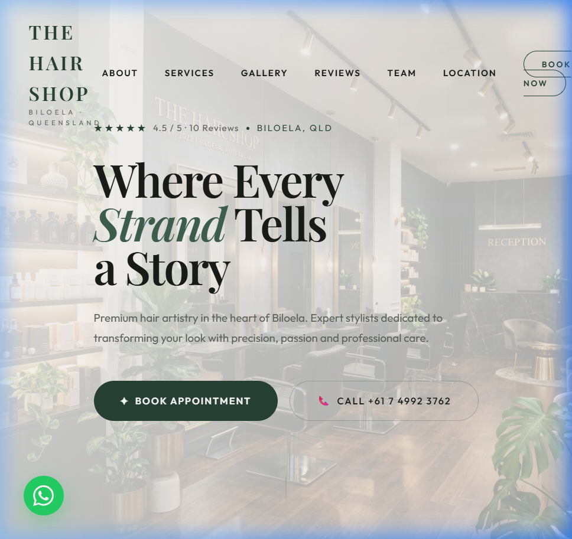
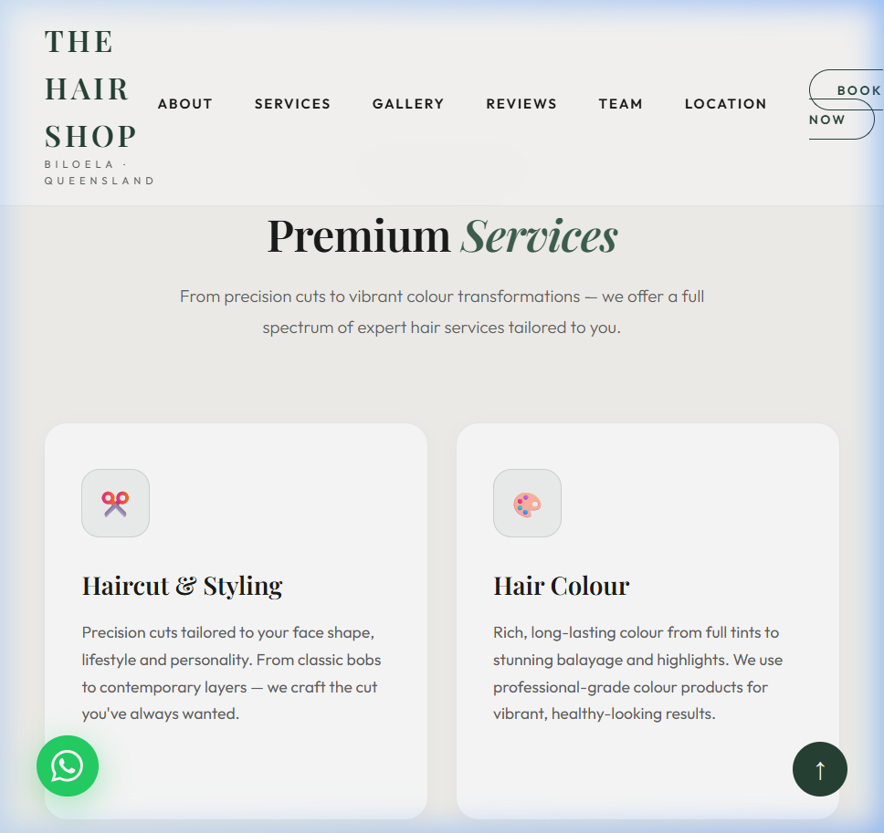
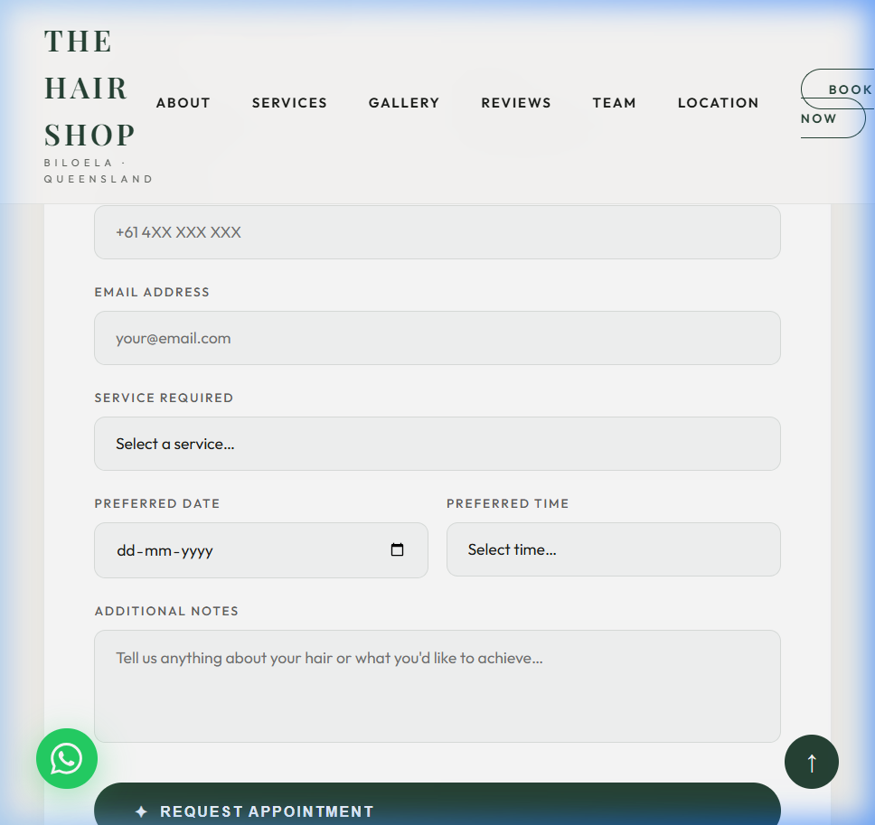

# 🌿 The Hair Shop — Premium Salon Website

[](https://chaudharyzaid56-lang.github.io/the-hair-shop-website/)
[](https://github.com/)

A premium, modern, and high-converting single-page website built for **The Hair Shop** (located in Biloela, Queensland, Australia). 

Designed to deliver an elite client experience, this site transitions away from dark-gold layouts into a fresh **Light Luxury Editorial (Sage Green & Charcoal)** style that feels clean, high-fashion, and organic.

---

## 🔗 Live Showcase
👉 **[View the Live Website Here](https://chaudharyzaid56-lang.github.io/the-hair-shop-website/)**

---

## 🎨 Visual Preview

### 1. Hero & Navigation Layout


### 2. Premium Services Grid


### 3. Integrated Booking Request Form


---

## 💎 Key Features & Business Conversion Strategy

This website was built not just to look good, but to act as a high-converting digital storefront that turns visitors into booked appointments.

*   **🎬 Custom Branded Page Loader:** An elegant branded preloader animation designed to buffer assets while providing a luxury feeling from the first second of access.
*   **🦸 High-Fashion Hero Section:** Features a stunning full-screen parallax background, dual call-to-actions (CTAs), and a prominent social proof badge displaying the Google Maps rating.
*   **💇 Interactive Services Directory:** 9 custom service cards mapping cuts, colours, styling, and treatments. Cards feature interactive arrow reveals, custom borders, and subtle raising animations on hover.
*   **🖼️ Filterable Masonry Portfolio:** A modular gallery split by category (All, Interior, Colour, Styling) utilizing custom JS filters and a fully responsive keyboard-accessible lightbox overlay.
*   **⭐ Testimonials Carousel:** An auto-advancing slide showcase of genuine customer reviews featuring avatar initials in gradient sage tones.
*   **📅 Comprehensive Booking Engine:** A clean two-column appointment request form with date/time pickers and success validations, alongside direct contact widgets.
*   **📍 Location & Opening Hours Integration:** Embeds a responsive Google Map alongside an automated hours table that programmatically highlights "Today" and displays if the salon is currently Open/Closed.
*   **🟢 Floating WhatsApp Button & Back-To-Top:** Quick access buttons pinned dynamically for easy communication and quick page navigation.

---

## 💻 Tech Stack & Architecture

*   **HTML5 Semantic Markup:** Native HTML5 semantic elements (`<nav>`, `<section>`, `<footer>`, `<aside>`) utilized to maximize SEO indexability and screen-reader accessibility.
*   **CSS3 Variable Architecture:** The entire visual system is controlled by modern CSS custom variables in the `:root`. Switching themes (e.g. to a dark mode, blush pink, or deep navy) takes seconds by swapping variable values.
*   **GSAP & ScrollTrigger:** High-performance hardware-accelerated animations that trigger smoothly as the user scrolls.
*   **Canvas Particles Background:** A background JavaScript animation that paints floating translucent green particles dynamically, rendering an organic, luxury touch behind the content.
*   **Zero Dependencies Build:** Written in vanilla CSS and ES6 JavaScript. No bundlers, compilers, or massive node packages required. Zero setup. Fast, clean, static delivery.

---

## 🚀 How to Run Locally

Since this site has no build step, running it locally is extremely simple:

### Option 1: Open Directly
Simply open `index.html` in any web browser:
```bash
# On Windows
start index.html

# On macOS
open index.html
```

### Option 2: Run a Local Server (Recommended)
To see transition animations and font connections perform at their best, serve the directory locally:

**Using Python (pre-installed on most machines):**
```bash
python -m http.server 8000
```
Then navigate to `http://localhost:8000` in your web browser.

**Using Node.js (via live-server):**
```bash
npx live-server
```

---

## 📄 License & Credits
*   **Author:** [chaudharyzaid56-lang](https://github.com/chaudharyzaid56-lang)
*   **Photography:** Salon imagery assets generated via Adobe Firefly/Midjourney. Sinclair Oldfield interior photos used as design references.
*   **Libraries:** GSAP Core + ScrollTrigger (Loaded via Cloudflare CDN).
